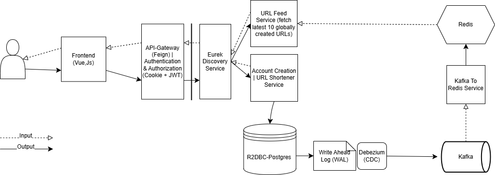

# URL Shortener Project

## Overview  

This project started as a single-threaded REST API and has evolved into a scalable, high-performance URL shortener
built with Java, Spring Boot, and a reactive microservices architecture.
It transforms long URLs into compact links using Base62 encoding, optimized for responsiveness and concurrency.

Key backend components include a non-blocking, multithreaded system using R2DBC with PostgreSQL, enabling efficient asynchronous data access.
The system exposes secure, RESTful APIs for URL creation and retrieval, protected with JWT-based authentication and authorization.

Real-time monitoring is achieved through Debezium CDC (Change Data Capture) integrated with Kafka, which captures and streams new URL creation events.
These events are consumed and cached in Redis, allowing the frontend to display the latest 10 created URLs globally, enhancing user experience and responsiveness.

The application follows a microservices architecture, leveraging Eureka for service discovery
and Feign for inter-service communication, simplifying HTTP client implementation and enabling dynamic service resolution.

A lightweight, responsive Vue.js frontend delivers a seamless user interface. I was initially using AOP; however, after making the application reactive, SLF4J and Logback were chosen for logging. Application monitoring and visualization are implemented with Micrometer, Prometheus, and Grafana, providing robust observability across services.

The entire project is containerized with Docker, and CI/CD pipelines are set up with GitHub Actions to support fast, reliable deployments.

---

## Features

- **Frontend:** Vue.js, JavaScript  
- **Backend:** Java, Spring Boot, reactive programming, multithreading  
- **Security:** JWT authentication/authorization, Cookies  
- **Service Discovery:** Enables dynamic discovery of microservices for scalable deployment (Eureka)
- **API Gateway:** Centralized routing and request handling, including authentication, rate limiting, and load balancing (Feign)
- **Testing:** Unit, Integration, and End-to-End (E2E) tests  
- **Monitoring:** Prometheus, Grafana  
- **Change Data Capture (CDC):** Debezium
- **Message Broker:** Kafka
- **Caching:** Redis
- **Containerization:** Docker  
- **Logging:** Slf4j, Logback, Micrometer

---

## High-Level Design



---

### Prerequisites

- Docker Desktop
- WSL (optional but convenient if on Windows)

### Installation

- Clone the repository
- A openssl public/private key will need to be generated and placed within the nginx directory to facilitate https

### Running Stack via Docker

```bash
docker-compose up
```

---

### Future Work / Improvements

While this project includes all the core features I initially set out to build, there’s always room for enhancement.
Once tests for kafka/redis are in place, the foundational goals will be complete.
The following improvements are planned for a future iteration:

- Add testing for api-gateway, url-feed-service, and url-kafka-consumer
- Implement Server-Sent Events (SSE) to stream the 10 most recent URLs from Redis, replacing the current REST-based approach
- Improve the frontend UI/UX (though this was not the primary focus of the project)
